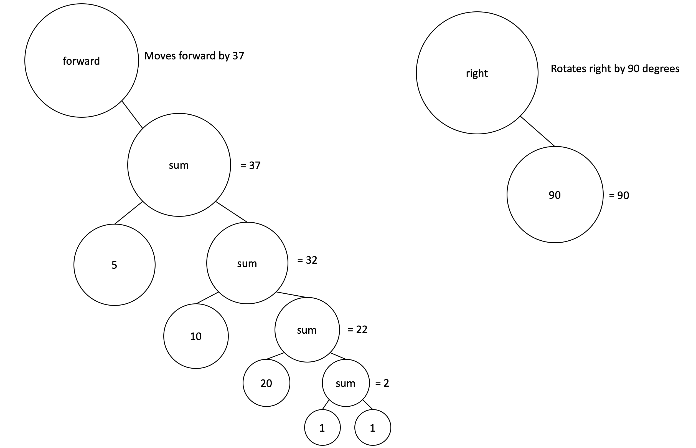
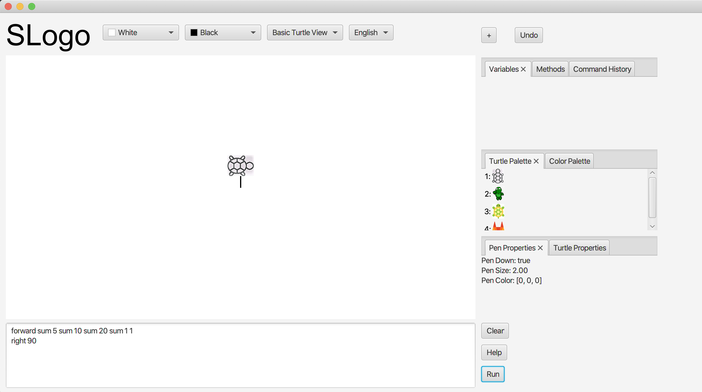
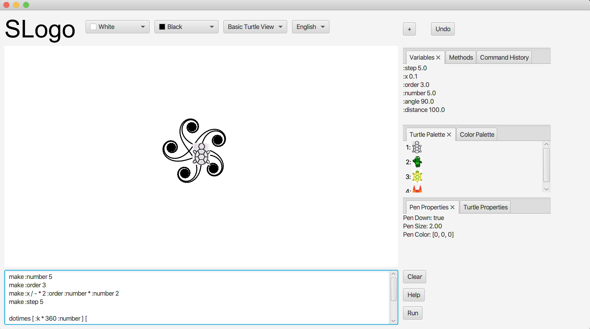
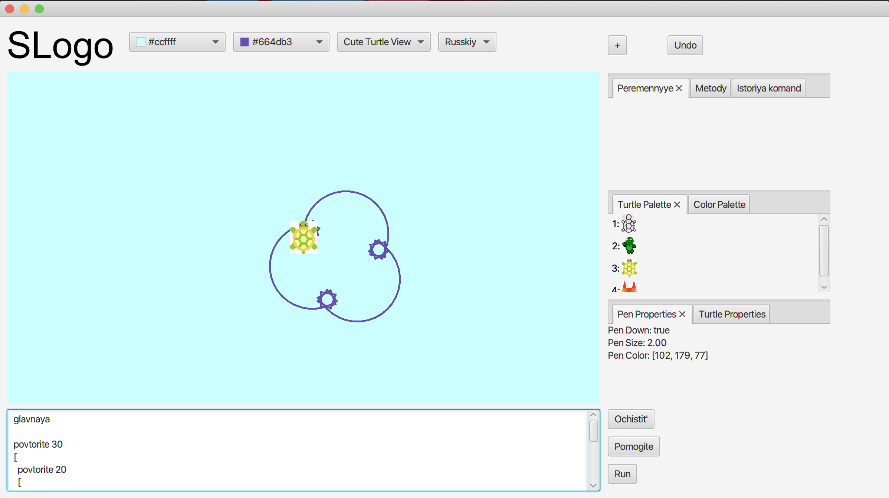

# SLogo

### Project Specifications
This is a project for the course Computer Science 308 - Software Design and Implementation.
In this course, I worked on a 4-person team to implement a simple version of Logo,
an educational programming language. Although this project was for a course, 
we had very little guidance and zero starter code, so all of the design decisions were
our own. For more details on the project specifications given to us, feel free to check
out the assignment page [here](https://www2.cs.duke.edu/courses/compsci308/spring19/assign/03_slogo/index.php).

### My Contributions
My responsibility in this project was to completely design and implement the parser code,
which takes in the user input and returns a Parse Tree of executable nodes for the Turtle 
object to execute. To view my code, look at [back_end/src/parser/](https://github.com/meganphibbons/SLogo/tree/master/back_end/src/parser), 
where I created all of the files. 

**Class Descriptions:**  
Generally, ``Parser.java`` is the main 
class. It uses ``CommandFactory.java`` to create Command nodes to add to the
parse tree. Additionally, it makes use of ``Validator.java``, which checks the 
user input to ensure that it follows SLogo syntax rules. ``UserCommand.java`` and 
``UserCreated.java`` are special classes designed to permit users to set their own 
variables and write their own methods. Lastly, ``CommandController.java`` is a
class available to other sections of the code. Using this class, the command nodes
can be parsed and executed.

### Design, Data Structures, and Algorithms
In order to properly implement a parser, I implemented a list of CommandNodes. Each 
CommandNode is the head of its own command tree. Any children that the CommandNode has 
represent nested commands or argument parameters. This is an important design choice
because in SLogo, every function call returns a value. To understand the way the
parse tree I created work, let's use an example.  
Input: 
```
forward sum 5 sum 10 sum 20 sum 1 1
right 90
```
This is a completely valid input to a SLogo program. For simplicity, I will
add parentheses to easily parse this. 
```
forward(sum(5, sum(10, sum(20, sum(1, 1)))))
right(90)
```
The result of this call would be the turtle moving forward by 37 then turning right.
When running this command through the parser, it will return a list of 
two CommandNodes, each of which is the head of its own tree. To visualize the tree created by my parser, I 
have included a graphic below. My code generates this tree and also provides a framework for executing these
commands.
  

### Project Screenshots
Output for example given above:


Output for following code snippet:
```
make :number 5
make :order 3
make :x / - * 2 :order :number * :number 2
make :step 5

dotimes [ :k * 360 :number ] [ 
  fd :step
  rt + :k :x
]
```


Additionally, prior to running code, you can chose to change the language, the pen/background color, and the image of the
turtle! 

Example using Russian commands with a Cute turtle view, light blue background, and purple pen. 
```
glavnaya

povtorite 30
[
  povtorite 20
  [
    vr 10
    pr 10
  ]
  povtorite 10
  [
    vr 20
    pr 100
  ]
]
```
